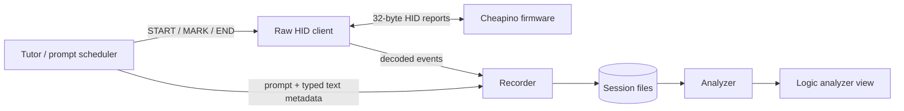

# Cheapino Typing Telemetry Lab — Implementation Blueprint

Status: design only; implementation intentionally deferred.

Target branch used for this design: `port/blay-cheapinov2-modern-vial`.

The goal is to build a typing-tutor-like experiment that records **what the Cheapino firmware actually sees and decides**, rather than inferring timings from Linux input events. The host application presents controlled typing prompts; the firmware records timestamped physical and logical events; the host stores, visualizes, and later analyzes them.

The first use case is tuning difficult tap/hold behavior, especially slow pinky keys and sequences such as `BS -> A`, `F -> '`, same-hand rolls, cross-hand rolls, thumb-to-pinky transitions, home-row mods, and layer-taps. The design is deliberately more general so it can later answer questions about any key, finger, layer, modifier, encoder action, or typing sequence.

---

## 1. Design goals

### Primary goals

1. Capture key timing **inside the firmware**, after electrical/matrix cleanup and debouncing.
2. Capture the later QMK decision for tap/hold and other logical processing.
3. Preserve enough state to correlate a physical press with the final QMK decision.
4. Make acquisition observational: telemetry must not change typing behavior in any meaningful way.
5. Use a bounded in-RAM event buffer; never write telemetry to flash/EEPROM.
6. Move data to the host using the Raw HID interface already present because Vial/VIA is enabled.
7. Allow the host to insert trial/session markers in the firmware time domain.
8. Store raw data in a durable, versioned format before doing any statistical interpretation.
9. Provide a clear logic-analyzer-style timeline with zoom, hover, per-key lanes, and decision markers.
10. Allow repeated exposures to the same word/sequence so learning effects can be separated from stable typing behavior.

### Non-goals for the first implementation

- Do not modify the QMK tap/hold algorithm yet.
- Do not auto-tune firmware parameters during acquisition.
- Do not depend on Linux `evdev` timings for the measurements.
- Do not stream debug text directly from matrix scan callbacks.
- Do not persist captured typing in keyboard flash.
- Do not patch generic QMK/Vial core unless later evidence shows a missing hook.

---

## 2. Key architectural decision: no QMK core patch for the MVP

The current Cheapino/Vial tree already exposes enough keyboard-level hooks to collect the useful stages without modifying generic QMK core.

### Current Cheapino matrix path

`keyboards/cheapino/matrix.c` currently performs:

1. raw matrix scan;
2. encoder extraction via `fix_encoder_action()`;
3. Cheapino-specific ghost suppression via `fix_ghosting()`;
4. return to generic QMK matrix code;
5. generic debounce updates the public `matrix[]` state;
6. QMK calls `matrix_scan_kb()`.

Therefore an implementation of `matrix_scan_kb()` at keyboard level can observe a matrix that is already:

- encoder-cleaned;
- ghost-suppressed;
- debounced.

That is the preferred definition of **physical key event** for this project. It is much more useful than Linux HID timing and much less noisy than raw GPIO timing.

### Current tap/hold path

The modern Vial-QMK tap/hold state machine delays `process_record()` until an ambiguous tap-hold event has been settled. Once the event is processed, `process_record_quantum()` invokes `process_record_kb()` before `process_action()`, and `post_process_record_kb()` is called after the action has been processed.

This gives us three useful observation stages:

```text
matrix / electrical state
        |
        v
Cheapino encoder cleanup + ghost suppression
        |
        v
debounce
        |
        +----> PHYSICAL event      [matrix_scan_kb]
        |
        v
QMK tapping / Flow Tap / Chordal Hold / layers
        |
        +----> RESOLVED event      [process_record_kb]
        |
        v
process_action()
        |
        +----> POST_ACTION state   [post_process_record_kb]
        |
        v
USB HID reports
```

For the MVP, `PHYSICAL + RESOLVED + POST_ACTION` is enough to distinguish:

- what the fingers physically did;
- when QMK made its tap/hold decision;
- which layer/modifier state resulted from that decision.

Exact USB report capture can be added later if a specific question requires it. That would be a fourth instrumentation point and may require a small generic-core/protocol hook; it should not be added preemptively.

---

## 3. Proposed repository layout

The project is Cheapino-specific, so keep it under the Cheapino keyboard tree instead of adding a top-level application to Vial-QMK.

```text
keyboards/cheapino/
├── cheapino.c
├── matrix.c
├── rules.mk
├── ...
├── features/
│   └── telemetry/
│       ├── telemetry.c          # ring buffer, event creation, capture enable
│       ├── telemetry.h          # firmware-facing API
│       └── protocol.h           # packed on-wire protocol shared conceptually with host
└── tools/
    └── typing-lab/
        ├── BLUEPRINT.md         # this document
        ├── pyproject.toml
        ├── README.md
        ├── src/
        │   └── cheapino_typing_lab/
        │       ├── __init__.py
        │       ├── cli.py
        │       ├── hid.py       # Raw HID transport
        │       ├── protocol.py  # packet/event decoder
        │       ├── recorder.py
        │       ├── tutor.py
        │       ├── corpus.py
        │       ├── model.py
        │       ├── metrics.py
        │       ├── analyzer.py
        │       └── export.py
        ├── corpora/
        │   ├── italian-core.toml
        │   ├── transitions.toml
        │   └── pinky-focus.toml
        ├── profiles/
        │   └── example-finger-map.toml
        └── tests/
            ├── test_protocol.py
            ├── test_metrics.py
            └── fixtures/
```

Do not create all of these files in the first commit. This is the intended endpoint and separation of responsibilities.

---

## 4. Firmware feature gating

Telemetry should be a compile-time optional feature and runtime disabled by default.

Suggested build variable:

```make
CHEAPINO_TELEMETRY_ENABLE = yes
```

`keyboards/cheapino/rules.mk` can conditionally add the source and C define:

```make
ifeq ($(strip $(CHEAPINO_TELEMETRY_ENABLE)), yes)
    SRC += features/telemetry/telemetry.c
    OPT_DEFS += -DCHEAPINO_TELEMETRY_ENABLE
endif
```

Build the instrumented firmware explicitly:

```sh
make cheapino:vial CHEAPINO_TELEMETRY_ENABLE=yes
```

The normal `cheapino:vial` build remains production behavior with telemetry code excluded.

Reasons for compile-time gating:

- makes normal firmware privacy-preserving by construction;
- makes binary-size/timing comparisons straightforward;
- prevents accidental always-on logging;
- allows an A/B firmware build to quantify instrumentation overhead.

---

## 5. Firmware capture points

### 5.1 PHYSICAL — post-debounce transitions

Implement `matrix_scan_kb()` at keyboard level. Keep a snapshot of the previous debounced matrix and diff it against `matrix_get_row(row)` on every scan.

Only enqueue an event when a bit changes.

Pseudocode:

```c
void matrix_scan_kb(void) {
#ifdef CHEAPINO_TELEMETRY_ENABLE
    cheapino_telemetry_scan_matrix();
#endif
    matrix_scan_user();
}
```

`cheapino_telemetry_scan_matrix()`:

```text
for each row:
    now = matrix_get_row(row)
    changed = now XOR previous[row]
    for each set bit in changed:
        emit PHYSICAL(timestamp, row, col, pressed)
    previous[row] = now
```

Properties:

- timestamp is taken as close as possible to the observation;
- no text formatting;
- no USB write;
- no heap allocation;
- no lookup that mutates QMK layer/action caches;
- only a small fixed-size struct copied to the ring buffer.

### 5.2 RESOLVED — event after QMK tap/hold settlement

Implement `process_record_kb()` at keyboard level.

This is the key observation point for `MT()` and `LT()` because the modern tapping state machine invokes `process_record()` after settling an ambiguous event. Record:

- timestamp;
- physical matrix row/column from `record->event.key`;
- resolved keycode argument;
- `pressed`;
- `record->tap.count`;
- `record->tap.interrupted` where available/relevant;
- current highest layer;
- current modifier state.

Then return `process_record_user(keycode, record)` so the hook remains transparent to keymaps.

Important interpretation:

- an `MT`/`LT` with `tap.count > 0` was processed as a tap;
- an `MT`/`LT` with `tap.count == 0` represents hold-side processing;
- the original quantum keycode should also be stored so the host knows which dual-role key was involved.

Do not attempt to reimplement QMK's tap/hold decision in telemetry. Observe it.

### 5.3 POST_ACTION — resulting state after `process_action()`

Implement `post_process_record_kb()` and enqueue a compact state snapshot after the action has executed:

- event position;
- keycode;
- pressed/released;
- active modifier mask;
- one-shot modifiers if useful;
- highest active layer;
- optionally full `layer_state` in a later protocol revision.

Then call `post_process_record_user()`.

This stage answers questions such as:

- did a mistaken `A/GUI` decision actually leave GUI active when the following key was processed?;
- when exactly did layer 4 become active after `LT(4, KC_BSPC)`?;
- did QMK resolve a hold but cancel/transform it before final action state?

### 5.4 Optional later stage — exact HID report

Only add this if PHYSICAL/RESOLVED/POST_ACTION is insufficient.

An exact HID stage would log the report sent to the USB host. This would be useful for diagnosing problems downstream of QMK action processing, but it is not necessary for the current tap/hold research and would require touching more generic protocol code.

---

## 6. Timestamping

Use QMK's monotonic `timer_read32()` for telemetry timestamps.

Milliseconds are appropriate for this experiment:

- human press durations are generally tens to hundreds of milliseconds;
- relevant overlaps are usually measured in milliseconds;
- QMK's tapping terms are expressed in milliseconds;
- 32-bit millisecond time wraps only after a long-running session and wrap can be handled by unsigned subtraction.

Do not use host arrival time as the measurement clock. USB/OS scheduling introduces jitter. Host timestamps can still be stored as diagnostics.

Every trial marker should be inserted into the firmware ring so the physical events and trial boundaries share the same clock.

---

## 7. Ring buffer

Use a fixed-size RAM ring buffer.

Suggested initial capacity:

```text
1024 events
```

With 12-byte events this is approximately 12 KiB, which is reasonable on RP2040 and gives a large safety margin for normal typing if the host temporarily stops draining.

Required behavior:

- statically allocated;
- no malloc/free;
- O(1) enqueue/dequeue;
- monotonically increasing sequence number;
- overflow counter;
- if full, choose one explicit policy and expose it in status.

Recommended overflow policy for scientific capture: **drop newest and increment `dropped_events`**. Do not silently overwrite old data because that can make a trial appear complete while its beginning has actually vanished.

The host must treat any non-zero drop count as an invalid/incomplete trial unless explicitly overridden.

Concurrency must be reviewed for the RP2040/ChibiOS path. If Raw HID callbacks can run concurrently with matrix/event processing, protect head/tail updates with the QMK platform's atomic/critical-section helper. Do not assume single-threaded access without checking the actual callback context.

---

## 8. Binary event format

The Vial/VIA Raw HID endpoint uses fixed 32-byte reports. Design the event structure so a response contains two complete events plus a compact header.

Suggested protocol v1 event: 12 bytes, little-endian.

```c
struct PACKED cheapino_telemetry_event_v1 {
    uint32_t timestamp_ms;   // firmware monotonic clock
    uint16_t value;          // keycode or event-specific value
    uint8_t  type;           // PHYSICAL, RESOLVED, POST_ACTION, MARKER, ...
    uint8_t  position;       // row << 4 | col; Cheapino fits in 4+4 bits
    uint8_t  flags;          // pressed, tap/hold, interrupted, etc.
    uint8_t  layer;          // highest active layer
    uint8_t  mods;           // active modifier mask
    uint8_t  aux;            // type-specific auxiliary byte
};
```

Cheapino currently has 8 rows and 12 columns, so four bits each are sufficient for row/column packing.

Suggested event types:

```text
0x01 PHYSICAL
0x02 RESOLVED
0x03 POST_ACTION
0x04 ENCODER          optional
0x10 TRIAL_MARKER
0x11 SESSION_MARKER
0x7E DIAGNOSTIC       optional
```

Suggested common flag bits:

```text
bit 0  pressed
bit 1  tap_count_nonzero
bit 2  interrupted
bit 3  synthetic/non-key event
bit 4  reserved
bit 5  reserved
bit 6  reserved
bit 7  reserved
```

Do not overload event semantics prematurely. Bump protocol version if the structure changes incompatibly.

---

## 9. Transport: reuse Vial/VIA Raw HID

### Why Raw HID

Vial/VIA already requires QMK Raw HID, therefore the current firmware already has a bidirectional 32-byte HID transport. Do not add console HID, CDC serial, sockets, or a second custom USB interface for the first implementation.

Benefits:

- no extra USB endpoint pressure;
- no extra driver;
- cross-platform HID API support;
- firmware timestamps remain authoritative;
- host can both drain events and insert trial markers;
- no debug printing in the critical scan path.

QMK's standard Raw HID usage page/usage are:

```text
usage page = 0xFF60
usage      = 0x61
report     = 32 bytes
```

The current Vial implementation routes command IDs it does not recognize to the keyboard-level weak hook `raw_hid_receive_kb()`, then sends the modified 32-byte buffer back to the host. This is ideal for this feature and avoids replacing Vial's `raw_hid_receive()`.

### Command-ID allocation

VIA currently owns the low command range and Vial uses `0xFE` as a prefix. Reserve a private block for the lab, for example:

```text
0x80 TELEMETRY_GET_INFO
0x81 TELEMETRY_STATUS
0x82 TELEMETRY_START
0x83 TELEMETRY_STOP
0x84 TELEMETRY_CLEAR
0x85 TELEMETRY_READ
0x86 TELEMETRY_MARK
0x87 TELEMETRY_PING
```

Before implementation, assert at compile time/documentation level that these IDs do not overlap the pinned Vial/VIA protocol used by this repository.

### 32-byte response proposal

```text
byte 0       command id
byte 1       telemetry protocol version
byte 2..3    response sequence
byte 4       event count (0..2)
byte 5       flags/status
byte 6..7    dropped-event counter low 16 bits
byte 8..19   event 0
byte 20..31  event 1
```

A `READ` request therefore drains at most two events. At 100 polls/s this supports 200 events/s; at 200 polls/s it supports 400 events/s. Human typing should normally be far below this even when recording several event stages per key. Measure actual worst-case event rate before freezing the polling interval.

### Trial markers

`TELEMETRY_MARK` should append a marker **inside firmware** at the moment the command is handled.

Payload should include at least:

```text
session_id
trial_id
phase       e.g. PROMPT_SHOWN / START / END / ABORT
repetition
prompt_id   stable integer/hash, not the full word
```

This eliminates the need to align host and keyboard clocks after the fact.

### Vial coexistence

The typing-lab host application and the Vial GUI should not be used simultaneously on the same Raw HID interface. The tool should detect/open the correct Raw HID interface and emit a clear error if it cannot obtain it.

---

## 10. Privacy and safety

This feature is intentionally capable of observing typing, so it must behave like an explicitly armed diagnostic instrument, not an invisible keylogger.

Required properties:

1. Compile-time telemetry support is optional.
2. Capture is OFF after boot/reset.
3. `START` explicitly clears/arms the session unless a `--resume` mode is later designed.
4. `STOP` disables capture immediately.
5. Buffer is RAM-only and disappears on reset/power loss.
6. No captured characters/events are written to QMK EEPROM or RP2040 flash.
7. Prefer a visible LED indication while capture is armed.
8. Consider an inactivity auto-stop (for example 15–30 minutes).
9. Consider requiring a physical arm gesture or Vial unlock state before `START` in a hardened version.
10. The host should warn before a session that firmware-level key telemetry will be recorded.

The production build should remain telemetry-free unless explicitly requested at build time.

---

## 11. Host application

### Language

Use Python 3.12+ initially. The experiment is dominated by UI/data-analysis iteration, not throughput, and Python has mature HID, dataframe, statistics, and visualization libraries.

### Proposed dependencies

Core:

```text
hid       Raw HID access (`pip install hid`, not the unrelated pyhidapi package)
textual   typing-tutor TUI
polars    fast columnar analysis and Parquet export
plotly    interactive logic-analyzer/timeline visualization
typer     CLI subcommands
```

Standard library:

```text
struct       binary packet codec
asyncio      recorder/UI coordination
json         raw metadata/manifests
pathlib      session layout
statistics   lightweight summaries
hashlib      prompt IDs / corpus integrity
```

Optional later:

```text
scipy       inferential statistics / distributions
numpy       numerical work if required by later analyses
pyqtgraph   only if a true high-refresh live logic analyzer becomes desirable
```

Avoid adding a Qt dependency for the MVP. Plotly gives zoom/pan/hover and browser rendering with much less application plumbing. A live `pyqtgraph` viewer can be added later without changing capture format.

### Host architecture



The Linux text input seen by the tutor is used only for:

- showing what was typed;
- scoring correctness;
- identifying corrections/backspaces;
- ending/aborting trials.

It is **not** the timing source for key analysis.

---

## 12. Host commands / UX

Proposed CLI:

```text
cheapino-lab doctor
cheapino-lab capture
cheapino-lab tutor --corpus pinky-focus
cheapino-lab analyze SESSION
cheapino-lab view SESSION
cheapino-lab export SESSION --format parquet
```

### `doctor`

Checks:

- Raw HID device enumeration;
- expected VID/PID/interface;
- telemetry protocol version;
- current firmware supports telemetry;
- ring capacity;
- capture currently disabled;
- Vial interface is accessible;
- optional firmware/build identifier.

### Tutor flow

```text
1. Open Raw HID.
2. GET_INFO / verify protocol compatibility.
3. START_SESSION.
4. Warm-up prompts, optionally excluded from analysis.
5. For each trial:
   a. choose prompt from deterministic schedule;
   b. send MARK(PROMPT_START, trial_id, exposure_index);
   c. render prompt;
   d. collect normal host text for correctness only;
   e. continuously poll/drain firmware events;
   f. send MARK(TRIAL_END);
   g. persist trial immediately.
6. STOP_SESSION.
7. verify no dropped firmware events.
8. generate session summary and analyzer HTML.
```

Do not wait until the end of the whole experiment to write files. Append/finalize after every trial so a crash loses at most one in-progress trial.

---

## 13. Session storage format

Never store only derived metrics. Preserve raw firmware events.

Suggested session directory:

```text
sessions/
└── 2026-09-11T143000-cheapino/
    ├── manifest.json
    ├── events.jsonl
    ├── trials.jsonl
    ├── typed.jsonl
    ├── events.parquet       # generated/derived convenience form
    ├── summary.json         # derived; reproducible from raw data
    └── analyzer.html        # derived visualization
```

`manifest.json` should include:

- telemetry protocol version;
- Git commit/build ID if available;
- keyboard VID/PID;
- Vial UID/build information if useful;
- capture options;
- corpus name + hash;
- RNG seed/order seed;
- host tool version;
- wall-clock session start;
- firmware uptime at session start;
- ring capacity;
- drop counter start/end;
- active experimental QMK settings where obtainable;
- user-entered notes.

`events.jsonl` should be append-only raw decoded events, one event per line. Parquet is generated from it for fast analysis.

---

## 14. Logic-analyzer visualization

The viewer should look like an instrument, not a typing-speed dashboard.

### Main timeline

Each physical key gets a digital lane. A key-down interval is rendered as a high level from DOWN to UP.

Example conceptual view:

```text
time ms          0      20      40      60      80     100     120
                  |       |       |       |       |       |       |
PHY  BS        ___|===============================|_______________
PHY  A         ______________|================|___________________
PHY  F         __________________________|===========|_____________

RES  BS/L4     ---------------------- T ---------------------------
RES  A/GUI     -------------------------------- H(GUI) ------------

MOD  GUI       ____________________________________|======|_______
LAYER 4        _________________________|===================|______

TRIAL          |<----------- "...prompt..." --------------------->|
```

The actual plot should support:

- wheel/pinch zoom on time;
- horizontal pan;
- hover tooltips;
- toggle groups: Physical / Resolved / Post-action / Markers;
- lane filtering by key, finger, hand, or event type;
- vertical cursor with exact time;
- selection of an interval to show metrics;
- trial boundaries and prompt label;
- visual indication of overlapping presses;
- explicit marker when QMK resolves TAP or HOLD;
- modifier/layer state lanes;
- dropped-event warning banner if capture integrity was lost.

### Event tooltip

Example:

```text
A / left pinky
PHYSICAL DOWN
firmware t = 18342 ms
trial = 17
exposure = 3
previous physical key = F
press-to-press = 74 ms
```

Resolved event:

```text
LGUI_T(KC_A)
RESOLVED HOLD
firmware t = 18491 ms
resolution latency = 149 ms
tap.count = 0
interrupted = true
layer = 0
mods before action = none
```

### Implementation

Generate `analyzer.html` with Plotly from recorded raw data.

Use horizontal shapes/segments rather than treating the signal as ordinary line-series samples; our data is transition/event based. This keeps the file compact and makes long sessions usable.

A later live mode can use `pyqtgraph` with the same event model if required.

---

## 15. Corpus design

The corpus should not be a random list of dictionary words. It is an experimental stimulus set.

Every prompt should carry tags describing which physical transitions it exercises.

### Prompt families

#### A. Natural-language baseline

Common Italian words/sentences to measure realistic typing behavior and adaptation to the keyboard.

Purpose:

- natural rhythm;
- realistic hand alternation;
- baseline error rate;
- fatigue/learning over a normal session.

#### B. Finger-transition probes

Words or pseudowords selected to exercise:

- same finger repetitions;
- pinky -> ring;
- ring -> pinky;
- pinky -> middle/index;
- inward same-hand rolls;
- outward same-hand rolls;
- left -> right alternation;
- right -> left alternation;
- thumb -> pinky;
- pinky -> thumb.

#### C. Tap/hold probes

Explicitly target keys currently configured as `MT()` or `LT()`:

- tap-hold key followed by same-hand alpha;
- tap-hold key followed by opposite-hand alpha;
- tap-hold key preceded by same-hand alpha;
- tap-hold key preceded by opposite-hand alpha;
- nested sequences;
- rolling sequences;
- sequences involving Backspace;
- sequences involving punctuation;
- intentional modifier chords for comparison.

Examples of classes, not hardcoded final words:

```text
BS -> A
A  -> BS
F  -> '
'  -> F
pinky -> opposite-hand letter
opposite-hand letter -> pinky
thumb LT -> pinky MT
pinky MT -> thumb LT
```

#### D. Intentional-hold calibration

To choose tap/hold policies, capture intentional holds too.

The tutor should occasionally prompt an explicit action such as:

```text
Hold GUI key, then press C
Hold layer key, then press 7
```

This creates two empirical distributions:

```text
normal typing overlap / hold duration
intentional modifier/layer hold timing
```

That is much more useful than choosing `TAPPING_TERM` from typing data alone.

---

## 16. Repetition and learning design

Learning is a first-class variable, not noise to discard.

For each selected prompt, record:

```text
exposure_index       how many times the prompt has previously appeared
immediate_repeat     whether previous trial was the same prompt
block_index
trial_index
session_elapsed
```

Use several repetition patterns:

### Spaced repetition

```text
A B C D A E F B ... A
```

Shows whether a sequence improves after general keyboard practice.

### Immediate repetition

```text
A A A A A
```

Shows rapid motor adaptation to a specific sequence.

### Delayed retest

Repeat early difficult prompts near the end of the session.

This lets analysis distinguish:

- stable biomechanical pattern;
- one-off unfamiliarity;
- rapid learning;
- general learning;
- fatigue.

The prompt scheduler must be deterministic from a stored RNG seed so the exact experiment can be reproduced.

---

## 17. Finger/hand model

Matrix row/column is authoritative. Key legends are secondary because Vial can remap the keyboard dynamically.

Maintain a small user/profile mapping:

```toml
[[key]]
row = 4
col = 10
hand = "left"
finger = "pinky"

[[key]]
row = 4
col = 9
hand = "left"
finger = "ring"
```

The profile should describe:

- hand;
- finger;
- thumb/pinky classification;
- optional ergonomic group.

Current dynamic keycodes should be obtained separately. Possible strategies, in order:

1. query the VIA/Vial dynamic keymap over the same Raw HID endpoint;
2. import a `.vial` export;
3. accept a static session mapping file for the initial MVP.

Do not infer finger assignment from `keyboard.json` geometry alone. The physical matrix geometry helps, but actual finger usage is user-specific.

---

## 18. Metrics to derive later

### Per-key

For each physical key:

- press duration = `UP - DOWN`;
- median, p10, p50, p90, p95, p99;
- median absolute deviation;
- press rate;
- correction/backspace association;
- tap/hold resolution latency;
- accidental hold rate where intent can be inferred from prompt.

### Pair / transition metrics

For consecutive keys A then B:

```text
press-to-press (PP)     down_B - down_A
release-to-press (RP)   down_B - up_A
release-to-release      up_B - up_A
overlap                 max(0, up_A - down_B)
```

Negative `release-to-press` means B was pressed before A was released.

Group by:

- physical key pair;
- finger pair;
- hand relation;
- same/opposite hand;
- inward/outward roll;
- prompt;
- exposure index;
- success/error.

### Tap/hold metrics

For every MT/LT:

- physical DOWN -> QMK resolution time;
- physical hold duration;
- TAP/HOLD decision;
- next physical key and timing;
- previous physical key and timing;
- same/opposite hand;
- layer/modifier effect after action;
- whether decision disagreed with intended prompt.

### Learning metrics

At minimum:

- metric by exposure index;
- slope from first to later exposures;
- immediate-repeat improvement;
- delayed-retention difference;
- per-key and per-transition change.

Start with robust descriptive statistics. Do not jump to complicated models before the capture quality and sample count are understood.

---

## 19. Important future capability: policy replay / what-if analysis

Once physical events are captured, we should be able to ask:

```text
What would have happened with TAPPING_TERM = 160 / 180 / 220?
What fraction of these sequences would Flow Tap protect at 100 / 125 / 150 ms?
Which same-hand rolls would Chordal Hold convert to taps?
Would a pinky-specific policy eliminate the errors without hurting intentional holds?
```

There are two possible levels:

### Approximate host simulator

Implement the relevant timing rules in Python for fast parameter sweeps. Useful for exploration, but it must be labeled approximate.

### Exact QMK replay

Later, build a QMK unit-test/replay harness that feeds recorded physical event sequences into the actual pinned tapping implementation. This is the preferred way to validate a candidate policy before flashing it.

Do not claim exact equivalence from a Python simulator unless it reproduces QMK's state machine and tests.

---

## 20. Experimental integrity / perturbation budget

We are measuring millisecond-scale behavior, therefore the logger itself must be measured.

Firmware rules:

- capture callback does a timestamp + struct write only;
- no `printf()` in capture path;
- no `raw_hid_send()` in capture path;
- no flash writes;
- no heap allocation;
- no long loops beyond matrix diff over the fixed matrix;
- host pulls data asynchronously;
- compile telemetry completely out of production firmware.

Validation experiment:

1. build production firmware;
2. measure matrix scan rate / typing behavior;
3. build telemetry-enabled firmware with capture disabled;
4. compare;
5. enable capture with host draining;
6. compare again;
7. quantify dropped events and maximum ring occupancy during stress typing.

If timing perturbation is measurable, optimize before collecting data for ergonomic decisions.

---

## 21. Firmware protocol state machine

Suggested runtime states:

```text
DISABLED
   |
   | START(session_id)
   v
ARMED / CAPTURING
   |  events -> ring
   |  MARK(trial)
   |  READ -> host drains
   |
   | STOP
   v
STOPPED
   |
   | CLEAR or START
   v
DISABLED / CAPTURING
```

`START` should return:

- accepted/rejected;
- protocol version;
- current firmware uptime;
- initial sequence number;
- current drop count;
- ring capacity.

`STATUS` should return:

- enabled;
- events queued;
- total events produced;
- dropped events;
- current uptime;
- session id.

---

## 22. Tests

### Firmware unit/host-side protocol tests

At minimum:

- event packing/unpacking is bit-exact;
- row/col packing covers all Cheapino positions;
- ring FIFO order;
- ring empty/full behavior;
- overflow increments counter;
- START clears/initializes correctly;
- STOP prevents event capture;
- MARK enters ring in correct order;
- READ returns 0/1/2 events correctly;
- packet version mismatch is rejected;
- unknown telemetry command does not interfere with Vial.

### Hardware tests

1. telemetry-disabled build still behaves identically;
2. Vial still opens and edits the keyboard when typing lab is not using the interface;
3. `doctor` identifies exactly one Raw HID interface;
4. press/release a single known key and verify one PHYSICAL down/up pair;
5. verify timestamp monotonicity;
6. verify physical event precedes resolved event where expected;
7. verify MT tap and MT hold produce different `tap.count`/resolution records;
8. verify LT changes layer only after the expected decision;
9. stress type for several minutes with zero dropped events;
10. unplug/reset during capture and confirm no persistent data remains.

### Golden trace tests

Store a few small synthetic traces in host test fixtures and assert exact metrics.

Example:

```text
A down @ 100
F down @ 160
A up   @ 190
F up   @ 230
```

Expected:

```text
A duration       90 ms
F duration       70 ms
A->F PP          60 ms
A->F overlap     30 ms
A->F RP         -30 ms
```

---

## 23. Implementation phases

### Phase 0 — freeze protocol/design

- confirm event fields;
- confirm command IDs do not collide;
- decide ring capacity;
- decide privacy arm behavior;
- write host codec tests before firmware implementation.

### Phase 1 — firmware physical capture

- conditional telemetry source;
- ring buffer;
- PHYSICAL events from `matrix_scan_kb()`;
- Raw HID GET_INFO/START/STOP/STATUS/READ/MARK;
- host `doctor` + raw recorder;
- verify zero drops and minimal perturbation.

Exit criterion: a key press/release appears in a host JSONL file with firmware timestamps and correct matrix position.

### Phase 2 — QMK decision capture

- RESOLVED events from `process_record_kb()`;
- POST_ACTION events from `post_process_record_kb()`;
- modifier/layer snapshots;
- MT/LT tap-vs-hold validation.

Exit criterion: a known `MT` and `LT` trace clearly shows physical timing, decision time, and resulting state.

### Phase 3 — typing tutor

- Textual prompt UI;
- deterministic corpus scheduler;
- trial markers;
- normal host text capture for correctness only;
- repetition/exposure metadata;
- session persistence.

Exit criterion: complete reproducible session can survive host restart/crash with all completed trials intact.

### Phase 4 — logic analyzer

- Plotly timeline;
- physical lanes;
- resolved decision markers;
- modifier/layer lanes;
- zoom/pan/hover;
- trial annotations.

Exit criterion: a problematic sequence can be understood visually without reading raw JSON.

### Phase 5 — metrics and corpus refinement

- per-key duration distributions;
- overlap metrics;
- transition matrix;
- pinky-focused corpus;
- repeated-exposure plots;
- error/decision correlation.

### Phase 6 — policy experiments

Only now evaluate:

- Flow Tap values;
- Chordal Hold;
- per-key tapping terms;
- pinky-specific policy;
- double-tap/hold alternatives;
- removing rarely used modifiers from home-row keys.

Run A/B sessions against the same experimental corpus.

---

## 24. First corpus proposal

The first useful session should be short enough to repeat often: approximately 10–15 minutes.

Suggested structure:

```text
Warm-up             2 min   excluded from primary metrics
Natural words       3 min   realistic baseline
Pinky transitions   3 min   targeted sequences
Tap/hold probes     3 min   MT/LT ambiguity
Immediate repeats   2 min   learning curve
Delayed retest      2 min   retention/stability
```

Do not optimize for WPM. Ask the user to type naturally and correct errors normally unless a trial explicitly says otherwise.

Some trials should intentionally prohibit correction so the original motor sequence is preserved; others should allow Backspace to measure natural correction behavior. Record that policy per trial.

---

## 25. Acceptance criteria for the whole project

The project is successful when, for any suspicious sequence, we can produce a trace answering all of these without relying on Linux key timing:

1. Which physical keys went down/up?
2. At what firmware timestamps?
3. How long was each key physically held?
4. How much did consecutive presses overlap?
5. Which QMK keycode was associated with each resolved event?
6. Did QMK settle the tap-hold as TAP or HOLD?
7. When did that resolution happen relative to the physical events?
8. Which modifiers/layers became active afterward?
9. Was the trial typed correctly according to the prompt?
10. Was this the first exposure or a repeated exposure?
11. Did the same transition improve with repetition?
12. Were any firmware events dropped?
13. Can the full trace be viewed as an interactive logic-analyzer timeline?
14. Can the raw session be re-analyzed later with new metrics without repeating the typing session?

If all fourteen are true, we have enough instrumentation to make data-driven tap/hold decisions instead of tuning by feel.

---

## 26. Specific implementation notes for the current branch

These points are based on the current `port/blay-cheapinov2-modern-vial` tree and should be rechecked if the Vial base is rebased again.

- `keyboards/cheapino/matrix.c` performs `fix_encoder_action()` and `fix_ghosting()` before returning to generic matrix processing.
- Generic matrix processing debounces and then calls `matrix_scan_kb()`, which makes that hook appropriate for post-debounce physical transitions.
- `process_record_kb()` is available in the normal QMK quantum path and is called once `process_record()` is reached.
- `post_process_record_kb()` runs after `process_action()`.
- VIA/Vial already uses Raw HID.
- `raw_hid_receive_kb()` is the intended keyboard-level handler for VIA command IDs not handled by generic VIA/Vial code.
- Raw HID reports are fixed at 32 bytes.
- The current keyboard metadata has 8 matrix rows and 12 columns, allowing row+column to fit in one byte.
- Current Cheapino metadata has console disabled; this design does not require enabling it.

This is deliberately structured so the first implementation should require changes only under `keyboards/cheapino/` plus the host tool under `keyboards/cheapino/tools/typing-lab/`.
